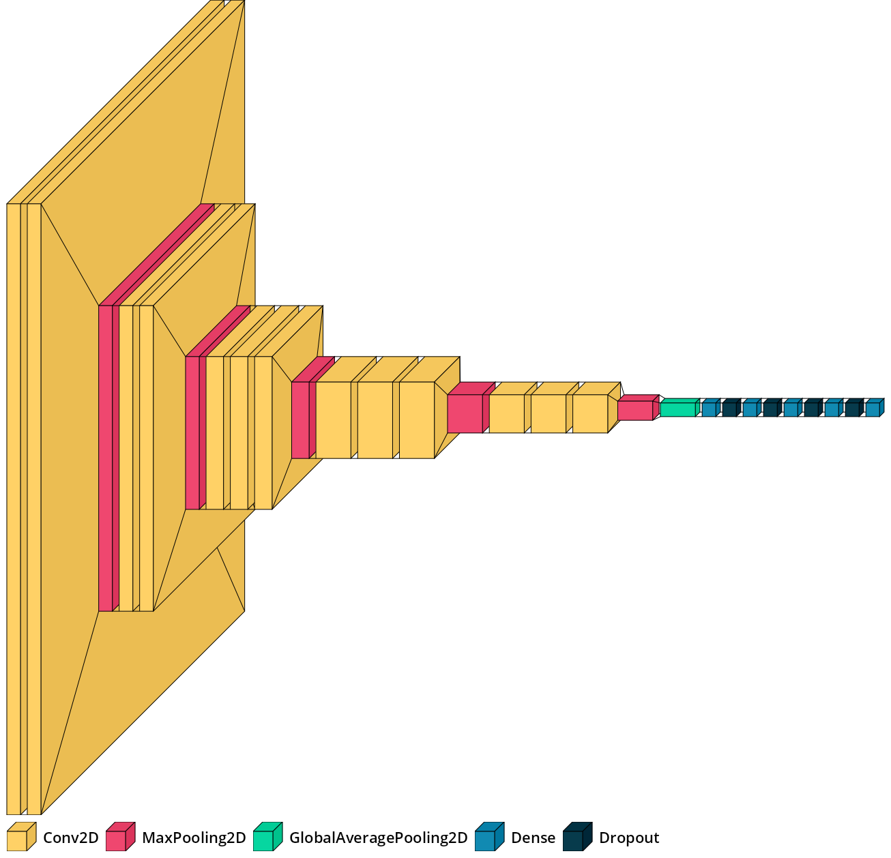

 

# Apple Scab Detection Using Deep Learning Based CNN

## *Abstract*

In this work, I address the task of  “Apple Scab Detection Using Deep Learning Based CNN” for the DSE-309 Advanced Programming in Python course. This project's scope is to detect apple scab in the early stage of development using deep learning based convolutional neural network (CNN). The dataset used for this project has two classes to predict, viz. ‘Healthy’ and ‘Scab’. Since the dataset has imbalanced classes, artificial data augmentation techniques have been used for augmenting the under-represented ‘Healthy’ class. The VGG-16 CNN model pre-trained on the ImageNet dataset is used as a feature extractor and a custom classifier is added to the model for the task of classification. Considering the class-imbalance present in the dataset, the custom VGG16 CNN  performed well, achieving an overall accuracy of 85.71% on the test set.

## 1. Tech Stack

|<a href="https://www.python.org/">

</a>|<a href="https://jupyter.org/">

</a>|<a href="https://ipython.org/">

</a>|<a href="https://numpy.org/">

</a>|<a href="https://pandas.pydata.org/">

</a>|
|---|---|---|---|---|

|<a href="https://matplotlib.org/">

</a>|<a href="https://seaborn.pydata.org/">

</a>|<a href="https://opencv.org/">

</a>|<a href="https://keras.io/">

</a>|<a href="https://www.tensorflow.org/">

</a>|
|---|---|---|---|---|

|<a href="https://scikit-learn.org/">

</a>|<a href="https://albumentations.ai/">

</a>|<a href="https://pillow.readthedocs.io/en/stable/">

</a>|<a href="https://github.com/philipperemy/keract">

</a>|<a href="https://github.com/paulgavrikov/visualkeras">

</a>|
|---|---|---|---|---|

## 2. Introduction

The main goal of smart and precise horticulture is to increase yield and product quality by simultaneous reduction of pesticide application, thereby promoting the amelioration of food security. Horticulture has high profitability and potential for growth to provide the market with diverse local foods. Apples are among the most widely grown and economically significant fruit worldwide, but the scab disease caused by the ascomycetous fungi <i>Venturia inaequalis</i> is the biggest challenge in cultivating apples [1]. Currently, scab control primarily relies on fungicide and pesticide applications. To solve the problem of scab disease, innovative farming techniques that can selectively and precisely use a minimal amount of pesticides are required. Early detection of scab disease using digital image acquisition and artificial intelligence based recognition methodology can help solve the problem. 

<b>Fig. 1. </b>A healthy apple (left) and an apple infected with scab (right).

## 3. The Dataset

The dataset used in this project is publicly available in the Kaggle repository under <i>CC BY-NC-ND 4.0</i> license: <a href="https://www.kaggle.com/projectlzp201910094/applescabfds"><i>AppleScabFDs</i></a> (Web, 2021a) [1]. The dataset contains images of healthy and infected apples. The images are grouped in two folders: ‘Healthy’ and ‘Scab’. The collection of digital images were carried out in different locations of Latvia. Digital images with characteristic scab symptoms on fruits were collected by the Institute of Horticulture (LatHort) with a goal to create a mobile application for apple scab detection using convolution neural networks. 

The dataset contains 297 images, with 90 images in the ‘Healthy’ class and 207 in the ‘Scab’ class. Out of these 297 images, 12 images are selected from the ‘Healthy’ class and 16 images from the ‘Scab’ class for the testing set. Table 1 shows the train-test split details of the dataset.

<!-- |                | <b>Train Set</b> | <b>Test Set</b> |
| :------------: | :--------------: | :-------------: |
| <b>Healthy</b> |        78        |       12        |
|  <b>Scab</b>   |       191        |       16        |
|     Total      |       269        |       28        | -->
<!-- 

    <table>
    <tr>
        <th></th>
        <th>Train Set</th>
        <th>Test Set</th>
    </tr>
    <tr>
        <td><b>Healthy</b></td>
        <td>78</td>
        <td>12</td>
    </tr>
    <tr>
        <td><b>Scab</b></td>
        <td>191</td>
        <td>16</td>
    </tr>
    <tr>
        <td>Total</td>
        <td>269</td>
        <td>28</td>
    </tr>
    </table>

 -->

|             | Train Set | Test Set |
| :---------: | :-------: | :------: |
|***Healthy***| 78        | 12       |
| ***Scab***  | 191       | 16       |
| **Total**   | 269       | 28       |

<b>Table 1. </b>Train-test split details.

<b>Fig. 2. </b>Proportion of the number of images in the original dataset.

## 4. Data Augmentation

There are 269 images in the train set, out of which only 78 images are there in the ‘Healthy’ class, which means there is class-imbalance present in the dataset. Artificial data augmentation has been applied using the Albumentations [2] library on the images belonging to the ‘Healthy’ class in the training set to minimize the extent of class-imbalance. By performing data augmentation, the no. of images present in the ‘Healthy’ class were increased from 78 to 156 (i.e. two times). The following techniques are used for augmenting the ‘Healthy’ class images:

* Random cropping
* Horizontal flipping
* Vertical flipping
* Rotation
* Random brightness and contrast
* Contrast Limited Adaptive Histogram Equalization (CLAHE)
* Color jitter

<!-- <table style = "margin-left: auto; margin-right: auto;">
  <tr>
    <th></th>
    <th>Train Set</th>
    <th>Test Set</th>
  </tr>
  <tr>
    <td><b>Healthy</b></td>
    <td>156</td>
    <td>12</td>
  </tr>
  <tr>
    <td><b>Scab</b></td>
    <td>191</td>
    <td>16</td>
  </tr>
  <tr>
    <td>Total</td>
    <td>347</td>
    <td>28</td>
  </tr>
</table> -->

|             | Train Set | Test Set |
| :---------: | :-------: | :------: |
|***Healthy***| 156       | 12       |
| ***Scab***  | 191       | 16       |
| **Total**   | 347       | 28       |

<b>Table 2. </b>Train-test split details after data augmentation.

<table style = "margin-left: auto; margin-right: auto;">
  <tr>
    <td>
 <b>Fig. 3. </b>Proportion of the number of images in the train set of the augmented dataset.
</td>
    <td>
 <b>Fig. 4. </b>Proportion of the number of images in the test set of the dataset.
</td>
  </tr>

</table>

## 5. Image Data Visualization

<b>Fig. 5. </b>Original healthy apple images along with their augmented image in the train set.

<b>Fig. 6. </b>Scab apple images in the train set.

## 6. Custom VGG16 CNN Architecture

VGGNet was introduced by Simonyan and Zisserman in 2014 [3]. This network is characterized by its simplicity. It contains 16 CONV/FC layers and features an architecture that only consists of 3×3 convolutions and 2×2 pooling from beginning to end. The model achieved 92.7% top-5 test accuracy in ImageNet, which is a dataset of over 14 million images belonging to 1000 classes [4].

In this project, I have implemented a custom VGG16 CNN model. VGG16 model that is pre-trained on the ImageNet dataset has been used as the feature extractor. A custom classifier is formed by stacking a global average pooling layer, and five fully-connected dense layers consisting of 128, 64, 32, 16, and 2 nodes respectively, having ReLU non-linearity in the first four dense layers and softmax activation in the last layer. Dropout layers with 10%, 20%, 30%, and 40% dropout rates have also been placed in between the fully-connected dense layers. The weights in the fully connected dense layers were initialized randomly with a normal distribution. The model was compiled with categorical cross-entropy loss, Adam optimizer, and accuracy error metric. The layers in the VGG16 feature extractor were kept frozen only the classifier was trained on the dataset. The architecture of the model is represented in Fig. 7.

<b>Fig. 7. </b>Custom VGG16 CNN architecture.

## 7. Training Details

The model was trained for 30 epochs, with an initial learning rate of 1.00×10−2 and a batch size of 16. Model checkpoint callback was used to save the best weights after each epoch; the callback monitored validation loss. A learning rate scheduler with an exponential rate decay schedule was also used for the training process. Early stopping callback was used for stopping the training process when validation loss stopped improving. Apart from these, a CSV logger callback was used for writing the results of each epoch to the CSV file. The same test set has been used for cross-validation during the model training process. To minimize the effect of class imbalance, class weights have been calculated and used while training, so that the model could pay more attention to samples from the under-represented ‘Healthy’ class.

## 8. Results

Each epoch took around fifty-six seconds to train. The model minimized the categorical cross-entropy loss up to 0.4299 and achieved an accuracy of  83.86% on the training set. Similarly, the categorical cross-entropy loss and accuracy metric were optimized up to 0.3354 and 87.50%, respectively on the validation set. On evaluating the model on the test set containing 28 images, the model gave the categorical cross-entropy loss value of 0.3665 and the accuracy metric value of 85.71% The training results are summarized in Table 3. The training plots are shown in Fig. 8 and the confusion matrix calculated on the test data is shown in Fig. 9.

<!-- <table style = "margin-left: auto; margin-right: auto;">
  <tr>
    <th>Epochs</th>
    <th>Initial LR</th>
    <th>Min. LR</th>
    <th>Train Loss</th>
    <th>Train Acc.</th>
    <th>Val. Loss</th>
    <th>Val. Acc.</th>
    <th>Test Loss</th>
    <th>Test Acc.</th>
  </tr>
  <tr>
    <td>30 (best 29th)</td>
    <td>1.00 × 10-2</td>
    <td>3.54 × 10-5</td>
    <td>0.4299</td>
    <td>83.86%</td>
    <td>0.3354</td>
    <td>87.50%</td>
    <td>0.3665</td>
    <td>85.71%</td>
  </tr>
</table> -->

|Epochs|Initial LR|Min. LR|Train Loss|Train Acc.|Val. Loss|Val. Acc.|Test Loss|Test Acc.|
|:---:|:---:|:---:|:---:|:---:|:---:|:---:|:---:|:---:|
|30 (best 29th)|1.00 × 10-2|3.54 × 10-5|0.4299|83.86%|0.3354|87.50%|0.3665|85.71%|

<b>Table 3. </b>Training summary.

(Note: Best model's loss and accuracy are mentioned in the table.)

<b>Fig. 8. </b>Training plots for Accuracy (leftmost), loss (middle), and learning rate decay (rightmost).

<b>Fig. 9. </b>Confusion matrix on test data.

From the confusion matrix, we can clearly see that the images belonging to the ‘Scab’ class are classified more accurately as compared to the ‘Healthy’ class. Also, some of the ‘Healthy’ images are misclassified as ‘Scab’. Due, the class-imbalance present in the dataset, the model could not properly generalize the images belonging to the ‘Healthy’ class. This problem can be solved by improving the quality of the dataset by collecting more images of healthy apples.

### 8.1. Activations Visualization

For understanding how the deep CNN model is able to classify the input image, we need to understand how the model sees the input image by looking at the output of its layers. By doing so, we are able to learn more about the working of these layers. 

<table style = "margin-left: auto; margin-right: auto;">
  <tr>
    <td>
 <b>(a) </b>block1_conv1
</td>
    <td>
 <b>(b) </b>block2_conv2
</td>
  </tr>
 <tr>
    <td>
 <b>(c) </b>block3_conv1
</td>
    <td>
 <b>(d) </b>block4_conv1
</td>
  </tr>

</table>

<b>Fig. 10. </b>Class activation maps of some convolution layers.

If we take a closer look at the class activation maps in Fig. 10, it is pretty clear to see how different filters in different layers are trying to highlight or activate different parts of the image. Some filters are acting as edge detectors, some are acting as background detectors, while others detect a particular region of the image like the central portion. It is easier to see this behavior of convolution layers in starting layers because the pattern captured by the convolution kernel becomes more and more sparse as we go deeper.

## 9. Conclusions

In this work, I have investigated the use of deep learning based CNN model to detect scab disease in digital images of apples. The proposed custom VGG16 model was able to detect scab disease with decent accuracy. Accuracy assessments of the model on the test set showed that the CNNs are promising about generalization in detecting the scab disease in digital images. The methodology outlined in this work can be replicated to classify similar kinds of diseases in other plant species as well. The results obtained by the model showed that the dataset should be more balanced and the image acquisition process should be monitored in a way to collect an equal number of images of all classes. Future work may involve investigating the capabilities of other state-of-the-art CNN architectures on the dataset.

## 10. Acknowledgement

I express my deep sense of gratitude to <a href="https://www.linkedin.com/in/parthiban-srinivasan-183608b/">Dr. Parthiban Srinivasan</a>, without his valuable guidance and supervision the project couldn't have been completed.

## 11. References

<ol type="1">
  <li>S. Kodors, G. Lacis, O. Sokolova, V. Zhukovs, I. Apeinans and T. Bartulsons. 2021. Apple Scab Detection using CNN and Transfer Learning. <i>Agronomy Research</i>, 19(2), 507–519. doi: 10.15159/AR.21.045.</li>
  <li>A. Buslaev, V. I. Iglovikov, E. Khvedchenya, A. Parinov, M. Druzhinin, and A. A. Kalinin, “Albumentations: Fast and Flexible Image Augmentations,” <i>Information</i>, vol. 11, no. 2, p. 125, Feb. 2020 [Online]. Available: <a href="http://dx.doi.org/10.3390/info11020125">http://dx.doi.org/10.3390/info11020125</a>.</li>
  <li>K. Simonyan en A. Zisserman, “Very Deep Convolutional Networks for Large-Scale Image Recognition”, <i>International Conference on Learning Representations</i>, 2015.</li>
  <li>J. Deng, W. Dong, R. Socher, L. Li, Kai Li and Li Fei-Fei, "ImageNet: A large-scale hierarchical image database," <i>2009 IEEE Conference on Computer Vision and Pattern Recognition</i>, 2009, pp. 248-255, doi: 10.1109/CVPR.2009.5206848.</li>
</ol>

